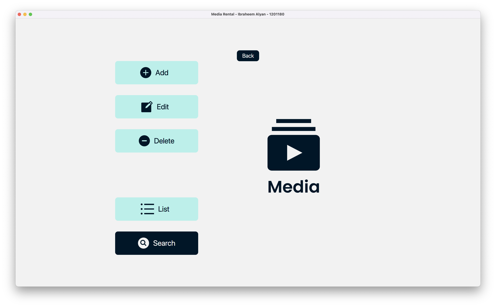
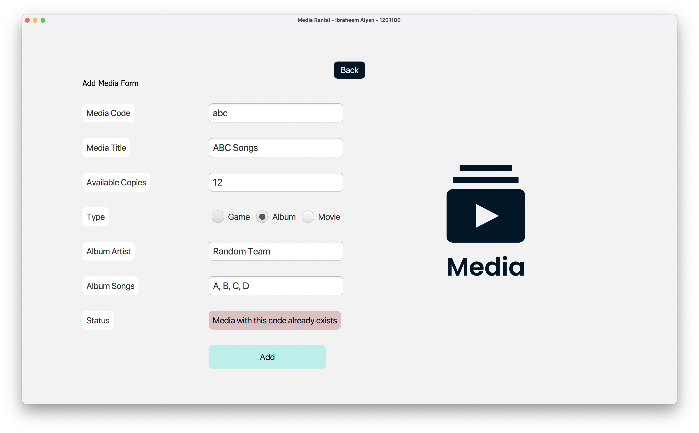

# COMP231 Final Project - Rental System

## About
a GUI java project, based on JavaFX, that acts like a media rental system, the system consists of users, and media ( Games, Movies, Albums ) with their CRUD functionalities and their relations, a user can add a media to his cart, remove it, rent it, return it, along with other functionalities like limiting user rents based on his plan, media avalabilty, ...    

> * the UI doesn't match the requested design (the implemented design is more user-friendly )

> * most styles are implemented in Stylesheets   

> * the project is very modular ( e.g. the Add, edit, delete, search functions all use the same class )

------------
## ScreenShots

------------

------------

------------

------------

------------

------------

------------

------------

------------

------------

------------

------------

------------

